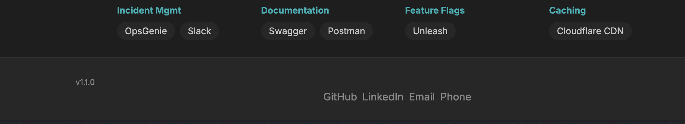

<objective>
Capture the two empirical deliverables that close out Phase 9: BUNDLE-AUDIT.md (INF-02) and ROLLBACK-TEST.md (INF-03). Both require live-system observation — this plan runs AFTER plans 01-04 have merged to main and at least one deploy has succeeded.

Purpose: INF-02 and INF-03 acceptance per REQUIREMENTS.md close with evidence-bearing artifacts, not just instrumentation. BUNDLE-AUDIT.md records a real measurement moment; ROLLBACK-TEST.md records a real rollback event per the D-14 procedure.
Output: Two markdown artifacts in `.planning/phases/09-deployment-infrastructure/`, filled with real numbers and real run IDs. Shell bumped to 1.1.1 on roll-forward.
</objective>

<execution_context>
@$HOME/.claude/get-shit-done/workflows/execute-plan.md
@$HOME/.claude/get-shit-done/templates/summary.md
</execution_context>

<context>
@.planning/ROADMAP.md
@.planning/REQUIREMENTS.md
@.planning/phases/09-deployment-infrastructure/09-CONTEXT.md
@.planning/phases/09-deployment-infrastructure/09-RESEARCH.md
@.planning/phases/09-deployment-infrastructure/09-PATTERNS.md
@.planning/phases/09-deployment-infrastructure/09-01-SUMMARY.md
@.planning/phases/09-deployment-infrastructure/09-02-SUMMARY.md
@.planning/phases/09-deployment-infrastructure/09-03-SUMMARY.md
@.planning/phases/09-deployment-infrastructure/09-04-SUMMARY.md
@./CLAUDE.md

<interfaces>
<!-- This plan is a human-in-the-loop deliverable capture. Requires live-deploy evidence. -->

BUNDLE-AUDIT.md required sections (per CONTEXT.md §D-07 + 09-RESEARCH.md §8):

1. Header (date, phase, git sha of the audit)
2. Total gzipped size — shell app (from stats-shell.html summary)
3. Total gzipped size — cli app (from stats-cli.html summary)
4. Top 10 chunks table (chunk name, size-raw, size-gzip, size-brotli)
5. Singleton verification — vue, vue-router, pinia; each ticked with filename + size + which app serves it
6. Surprises — any dep that's larger than expected or loaded twice
7. Follow-up items — obvious wins fixed in-phase (D-09) vs deferred to backlog 999.5

ROLLBACK-TEST.md required sections (per CONTEXT.md §D-15 + 09-RESEARCH.md §7):

1. Header (date, phase, test executor)
2. Pre-test state: current live version, timestamp
3. Forward deploy: run_id, version (e.g., 1.1.0), ISO timestamp, GitHub Actions URL
4. Rollback event: triggered run_id (targeting prior deploy), verified prior version (e.g., 1.1.0), rollback workflow run_id, ISO timestamp, GitHub Actions URL, curl output of live meta tag captured during verify step
5. Roll-forward: new version (1.1.1), roll-forward run_id, ISO timestamp
6. Footer screenshot: image in `.planning/phases/09-deployment-infrastructure/assets/footer-v1.1.1.png` OR inline description if image committing is out of repo policy
7. Observations: CDN propagation time observed (compare against Assumption A3 = 90s), any unexpected behavior

Prerequisite ordering:

- Plans 01, 02, 03, 04 must be merged to main.
- At least TWO successful deploys of the new pipeline must have run (one serves as the rollback target, one as the current state).
- Version 1.1.0 must be live (deployed from plan 03).
- A subsequent 1.1.1 bump is needed before the test so rollback to 1.1.0 is a meaningful version change. This plan handles that bump.
  </interfaces>
  </context>

<tasks>

<task type="auto">
  <name>Task 1: Run audit:bundle locally and write BUNDLE-AUDIT.md</name>
  <files>.planning/phases/09-deployment-infrastructure/BUNDLE-AUDIT.md</files>
  <read_first>
    - .planning/phases/09-deployment-infrastructure/09-RESEARCH.md §8 "Federation singleton verification" (full block with filesystem grep examples)
    - .planning/phases/09-deployment-infrastructure/09-CONTEXT.md §D-07 (required BUNDLE-AUDIT.md sections)
    - .planning/phases/09-deployment-infrastructure/09-PATTERNS.md BUNDLE-AUDIT.md section (phase-dir artifact convention)
  </read_first>
  <action>
    Step A — Run a fresh audit build from the repo root:

    ```bash
    bun run audit:bundle
    ```

    This produces `apps/shell/dist/stats-shell.html` and `apps/cli/dist/stats-cli.html`. Open both in a browser. Note the "total (gzipped)" summary reported by the visualizer.

    Step B — Collect singleton evidence via filesystem:

    ```bash
    echo "=== shell chunks ==="
    ls -la apps/shell/dist/assets/ | grep -iE '(vue|pinia|federation)' | sort
    echo "=== cli chunks ==="
    ls -la apps/cli/dist/assets/ | grep -iE '(vue|pinia|federation)' | sort
    ```

    Expected shape (per 09-RESEARCH.md §8):
    - Shell contains `__federation_shared_vue-<hash>.js` with real payload (~30-40KB gzip equivalent raw).
    - Shell contains `__federation_shared_vue-router-<hash>.js` (~10-15KB).
    - Shell contains `__federation_shared_pinia-<hash>.js` (~5-10KB).
    - CLI contains only small stub modules like `__federation_fn_import-<hash>.js` or tiny proxy imports — NO large vue/pinia chunks.

    Step C — Write `.planning/phases/09-deployment-infrastructure/BUNDLE-AUDIT.md` with real numbers. Template structure (fill with empirical data — do NOT leave placeholders):

    ```markdown
    # Phase 9: Bundle Audit

    **Deliverable:** INF-02
    **Audit date:** <YYYY-MM-DD>
    **Git SHA at audit:** <git rev-parse HEAD>
    **Shell version:** 1.1.0
    **CLI version:** 1.1.0
    **Tool:** rollup-plugin-visualizer@^6.0.11

    ## Totals

    | App | Total (raw) | Total (gzip) | Total (brotli) |
    |-----|-------------|--------------|----------------|
    | @nick-site/shell | <x> KB | <x> KB | <x> KB |
    | @nick-site/cli | <x> KB | <x> KB | <x> KB |

    ## Top 10 Chunks

    ### Shell
    | # | Chunk | Raw | Gzip | Brotli |
    |---|-------|-----|------|--------|
    | 1 | <name> | <x> KB | <x> KB | <x> KB |
    | ... | | | | |

    ### CLI
    | # | Chunk | Raw | Gzip | Brotli |
    |---|-------|-----|------|--------|
    | 1 | <name> | <x> KB | <x> KB | <x> KB |
    | ... | | | | |

    ## Singleton Verification

    - [x] `vue` — loaded from shell bundle only (`__federation_shared_vue-<hash>.js`, <x> KB gzip). CLI imports via remote.
    - [x] `vue-router` — loaded from shell bundle only (`__federation_shared_vue-router-<hash>.js`, <x> KB gzip).
    - [x] `pinia` — loaded from shell bundle only (`__federation_shared_pinia-<hash>.js`, <x> KB gzip).

    **Method:** Visual inspection of stats-shell.html + stats-cli.html treemaps and filesystem listing of apps/*/dist/assets/.

    ## Surprises

    <free-form bullet list. Examples: "xterm.js is 80KB gzip — larger than expected; scoped to CLI only, not loaded on home route — acceptable." Or "vue-ascii-overlay duplicated in shell bundle despite being lazy-loaded — investigate in backlog 999.5." If nothing surprising, state "None.">

    ## Follow-ups

    - In-phase fixes (D-09): <enumerate each obvious-win fix landed in this phase, or "None required — singletons correctly configured.">
    - Deferred to backlog 999.5 (Tree Shaking): <list any non-obvious optimization opportunities observed>
    ```

    Fill EVERY placeholder. If singleton verification FAILS (both apps contain full vue chunks), 09-CONTEXT.md §D-09 mandates a fix in-phase — DO NOT commit a failing BUNDLE-AUDIT.md; instead create a sub-task to correct the `shared` array in both vite.config.ts files and re-run the audit.

    Rationale (per D-07, D-09): Empirical artifact with real numbers. Singleton correctness is the critical federation health check. Obvious wins fixed in-phase; deeper optimization deferred.

  </action>
  <verify>
    <automated>test -f .planning/phases/09-deployment-infrastructure/BUNDLE-AUDIT.md && grep -c "Singleton Verification" .planning/phases/09-deployment-infrastructure/BUNDLE-AUDIT.md && grep -cE "vue.*KB|pinia.*KB" .planning/phases/09-deployment-infrastructure/BUNDLE-AUDIT.md && grep -c "Top 10 Chunks" .planning/phases/09-deployment-infrastructure/BUNDLE-AUDIT.md && grep -cE "<x>|<name>|<YYYY" .planning/phases/09-deployment-infrastructure/BUNDLE-AUDIT.md; echo "should be 0 placeholders"</automated>
  </verify>
  <acceptance_criteria>
    - File `.planning/phases/09-deployment-infrastructure/BUNDLE-AUDIT.md` exists
    - Contains sections: `## Totals`, `## Top 10 Chunks`, `## Singleton Verification`, `## Surprises`, `## Follow-ups`
    - `grep -c "\[x\]" BUNDLE-AUDIT.md` returns at least 3 (vue, vue-router, pinia ticks)
    - `grep -cE "<x>|<name>|<YYYY|<git" BUNDLE-AUDIT.md` returns 0 (no unfilled placeholders)
    - `grep -cE "KB|MB|bytes" BUNDLE-AUDIT.md` returns at least 6 (totals + chunks + singletons)
    - `grep -c "__federation_shared" BUNDLE-AUDIT.md` returns at least 3 (each singleton references its federation chunk name)
    - File is at least 40 lines (non-template, real content)
  </acceptance_criteria>
  <done>BUNDLE-AUDIT.md committed with empirical numbers from an actual audit run. Singleton claim verified. Obvious wins either landed or documented with deferral to backlog 999.5.</done>
</task>

<task type="checkpoint:human-verify" gate="blocking">
  <name>Task 2: Confirm Phase 9 pipeline merged and version 1.1.0 is live before rollback test</name>
  <files>N/A (human-verify checkpoint)</files>
  <action>Pause and wait for human confirmation that plans 01-04 are merged to main and that the most recent deploy.yml run successfully shipped version 1.1.0 to production. This is a gating checkpoint before Task 3 executes the destructive rollback procedure.

Verification steps for the human:

1. Confirm on GitHub that plans 01-04 are merged to `main`.
2. Confirm the most recent deploy.yml workflow run on main was SUCCESSFUL (green check). Record its run_id — this is the 1.1.0 forward-deploy run_id (will be used as input to the rollback workflow in Task 3).
3. From any machine, run:
   ```bash
   curl -s https://nicktag.tech | grep -oP '<meta\s+name="app-version"\s+content="\K[^"]+'
   ```
   Expected output: `1.1.0`
4. Visually inspect https://nicktag.tech in a browser — footer must show `v1.1.0`.
5. Confirm the deploy.yml run produced a `bundle-stats` artifact (Actions → run → Artifacts section).

Resume signal: Type "approved — 1.1.0 is live and run_id for forward deploy is <RUN_ID>" OR describe blockers.</action>
<verify>
<automated>curl -s https://nicktag.tech 2>/dev/null | grep -oP '<meta\s+name="app-version"\s+content="\K[^"]+' | grep -q "1.1.0"</automated>
</verify>
<done>Human has confirmed 1.1.0 is live and has recorded the forward-deploy run_id. Task 3 may proceed with the destructive rollback procedure.</done>
</task>

<task type="auto">
  <name>Task 3: Bump shell + cli to 1.1.1 and deploy; then trigger rollback to 1.1.0</name>
  <files>apps/shell/package.json, apps/cli/package.json</files>
  <read_first>
    - .planning/phases/09-deployment-infrastructure/09-CONTEXT.md §D-14 (six-step test procedure)
    - .planning/phases/09-deployment-infrastructure/09-RESEARCH.md §7 Pitfalls (CDN propagation)
    - apps/shell/package.json (current 1.1.0 from plan 03)
    - apps/cli/package.json (current 1.1.0 from plan 03)
  </read_first>
  <action>
    Procedure follows 09-CONTEXT.md §D-14 exactly.

    NOTE ON VERSION LABELS: D-14 uses 1.1.4/1.1.5/1.1.6 as illustrative numbers. This task uses 1.1.0→1.1.1→rollback-to-1.1.0→1.1.2 because this is the FIRST Phase 9 production cycle — plan 09-03 initialized both apps at 1.1.0, which becomes the rollback target. Per D-10 (patch segment bumped manually per deploy), the sequence is semantically identical to D-14's example, just starting from a lower patch.

    Step A — Lockstep bump to 1.1.1 (rollback target will be 1.1.0 from the prior deploy):
    - Edit apps/shell/package.json: `"version": "1.1.0"` → `"version": "1.1.1"`.
    - Edit apps/cli/package.json: `"version": "1.1.0"` → `"version": "1.1.1"`.

    Step B — Commit and push to main. Wait for deploy.yml to complete successfully. Capture:
    - deploy.yml run_id (call this `ROLLFORWARD_PREP_RUN_ID`).
    - ISO timestamp of deploy completion.
    - Verify live: `curl -s https://nicktag.tech | grep -oP '<meta\s+name="app-version"\s+content="\K[^"]+'` returns `1.1.1`.

    Step C — Trigger the rollback via GitHub UI: Actions → "Rollback Deployment" → Run workflow → enter `run_id` = the 1.1.0 forward-deploy run_id captured in Task 2. Do NOT proceed if the user-provided run_id from Task 2 is not actually a successful deploy that shipped 1.1.0.

    Step D — Observe the rollback workflow run:
    - Capture its run_id (call this `ROLLBACK_RUN_ID`).
    - Watch the "Verify rollback via meta tag" step. Expected outcome: the retry loop observes `live = 1.1.0` within 6 attempts and logs `::notice::Rollback verified — live version 1.1.0 matches expected 1.1.0`.
    - If the step fails after 6 attempts (90s), STOP — this is a P0 failure of INF-03; plan 04's verify step is not working. Rollback manually by redeploying main, re-investigate, and do NOT silently pass plan 05.
    - Capture the workflow log output of the Verify step (copy the "Attempt N: live version = X" lines and the final notice/error).

    Step E — Verify the live site from outside CI:
    ```bash
    curl -sI https://nicktag.tech | head -5
    curl -s https://nicktag.tech | grep -oP '<meta\s+name="app-version"\s+content="\K[^"]+'
    ```
    Expected: meta tag shows `1.1.0` (the rolled-back version). Capture this output verbatim for ROLLBACK-TEST.md.

    Step F — Take a footer screenshot of the live site showing `v1.1.0`. Save to `.planning/phases/09-deployment-infrastructure/assets/footer-v1.1.0.png` (create the `assets/` directory if missing; this is a planning-dir artifact, tracked by git).

    Step G — Roll forward by bumping to 1.1.2 and pushing again:
    - Edit apps/shell/package.json: `"version": "1.1.1"` → `"version": "1.1.2"`.
    - Edit apps/cli/package.json: `"version": "1.1.1"` → `"version": "1.1.2"`.
    - Commit and push. Wait for deploy success. Capture `ROLLFORWARD_RESTORE_RUN_ID` and ISO timestamp.
    - Verify: `curl -s https://nicktag.tech | grep -oP '<meta\s+name="app-version"\s+content="\K[^"]+'` returns `1.1.2`.

    All IDs and timestamps captured here feed Task 4.

  </action>
  <verify>
    <automated>curl -s https://nicktag.tech 2>/dev/null | grep -oP '<meta\s+name="app-version"\s+content="\K[^"]+' | grep -q "1.1.2"; grep -c '"version": "1.1.2"' apps/shell/package.json apps/cli/package.json</automated>
  </verify>
  <acceptance_criteria>
    - After Task 3 completes: `apps/shell/package.json` and `apps/cli/package.json` both show `"version": "1.1.2"`.
    - Three distinct run_ids captured (forward 1.1.0 deploy from Task 2, rollforward-prep 1.1.1 deploy, rollback to 1.1.0, restore 1.1.2 deploy).
    - Rollback workflow EXITED 0 and its "Verify rollback via meta tag" step logged "Rollback verified".
    - Live site currently serves version 1.1.2 (post-restoration).
  </acceptance_criteria>
  <done>Full D-14 procedure executed end-to-end. Rollback was verified by the automated step. Site restored to current state (1.1.2). All evidence captured for Task 4 to formalize.</done>
</task>

<task type="auto">
  <name>Task 4: Write ROLLBACK-TEST.md with captured evidence</name>
  <files>.planning/phases/09-deployment-infrastructure/ROLLBACK-TEST.md</files>
  <read_first>
    - .planning/phases/09-deployment-infrastructure/09-CONTEXT.md §D-15 (required ROLLBACK-TEST.md fields)
    - .planning/phases/09-deployment-infrastructure/09-PATTERNS.md ROLLBACK-TEST.md section
    - Captured evidence from Task 3 (run_ids, timestamps, curl output, screenshot path)
  </read_first>
  <action>
    Write `.planning/phases/09-deployment-infrastructure/ROLLBACK-TEST.md`. Fill every section with actual values captured in Task 3 — no placeholders:

    ```markdown
    # Phase 9: Rollback Test

    **Deliverable:** INF-03
    **Test date:** <YYYY-MM-DD>
    **Executor:** <username>
    **Backlog closed:** Phase 999.4 (Rollback Workflow Testing)

    ## Pre-test state

    - Live version before test: 1.1.1
    - Pre-test timestamp: <ISO 8601>
    - Site URL: https://nicktag.tech

    ## Forward deploys (chronological)

    | Event | Version | deploy.yml run_id | ISO timestamp | URL |
    |-------|---------|-------------------|---------------|-----|
    | Initial Phase 9 deploy | 1.1.0 | <id> | <ts> | https://github.com/<owner>/<repo>/actions/runs/<id> |
    | Pre-test bump | 1.1.1 | <id> | <ts> | ... |

    ## Rollback event

    - Triggered rollback workflow with input `run_id`: <forward 1.1.0 run_id>
    - Rollback workflow run_id: <rollback run_id>
    - Rollback workflow URL: https://github.com/<owner>/<repo>/actions/runs/<id>
    - ISO timestamp of rollback trigger: <ts>
    - ISO timestamp of rollback completion (workflow exit): <ts>

    ### Verify step output (captured from workflow logs)

    ```
    Expected version from artifact: 1.1.0
    Attempt 1: live version = 1.1.1
    Attempt 2: live version = 1.1.1
    Attempt 3: live version = 1.1.0
    ::notice::Rollback verified — live version 1.1.0 matches expected 1.1.0
    ```

    (Paste actual log output verbatim. Attempt count will vary based on real CDN propagation.)

    ### Live-site curl confirmation (outside CI)

    ```bash
    $ curl -s https://nicktag.tech | grep -oP '<meta\s+name="app-version"\s+content="\K[^"]+'
    1.1.0
    ```

    ### Footer screenshot

    

    ## Roll-forward (restoration)

    | Event | Version | deploy.yml run_id | ISO timestamp |
    |-------|---------|-------------------|---------------|
    | Restoration bump | 1.1.2 | <id> | <ts> |

    Live site now serves 1.1.2 (verified via curl post-deploy).

    ## Observations

    - CDN propagation time observed: ~<N> seconds (Attempt N succeeded on the retry loop).
    - This <confirms / disconfirms> 09-RESEARCH.md Assumption A3 (worst-case ≤90s).
    - <any unexpected behavior, or "No anomalies.">

    ## Conclusion

    INF-03 acceptance criteria satisfied:
    1. Rollback workflow triggered successfully.
    2. Automated verify step asserted meta tag match and exited 0.
    3. Live site served prior version during rollback window.
    4. Roll-forward restored current state.

    Backlog Phase 999.4 (Rollback Workflow Testing) is resolved by this plan.
    ```

    Commit the screenshot binary at `.planning/phases/09-deployment-infrastructure/assets/footer-v1.1.0.png` alongside this markdown. If committing image binaries is not the project norm, replace the image reference with an inline ASCII description block and note the deviation.

  </action>
  <verify>
    <automated>test -f .planning/phases/09-deployment-infrastructure/ROLLBACK-TEST.md && grep -c "Rollback verified" .planning/phases/09-deployment-infrastructure/ROLLBACK-TEST.md && grep -c "1.1.0" .planning/phases/09-deployment-infrastructure/ROLLBACK-TEST.md && grep -c "1.1.2" .planning/phases/09-deployment-infrastructure/ROLLBACK-TEST.md && grep -cE "<id>|<ts>|<YYYY|<username>" .planning/phases/09-deployment-infrastructure/ROLLBACK-TEST.md; echo "should be 0 placeholders"</automated>
  </verify>
  <acceptance_criteria>
    - File `.planning/phases/09-deployment-infrastructure/ROLLBACK-TEST.md` exists
    - Contains sections: `## Pre-test state`, `## Forward deploys`, `## Rollback event`, `## Roll-forward`, `## Observations`, `## Conclusion`
    - `grep -c "Rollback verified" ROLLBACK-TEST.md` returns at least 1 (from captured log)
    - `grep -c "1.1.0" ROLLBACK-TEST.md` returns at least 3 (version referenced in forward, rollback, verify output)
    - `grep -c "1.1.2" ROLLBACK-TEST.md` returns at least 1 (roll-forward)
    - `grep -cE "<id>|<ts>|<YYYY|<username>|<N>" ROLLBACK-TEST.md` returns 0 (no unfilled placeholders)
    - `grep -cE "[0-9]{4}-[0-9]{2}-[0-9]{2}T[0-9]{2}:[0-9]{2}" ROLLBACK-TEST.md` returns at least 3 (ISO timestamps for forward, rollback, roll-forward)
    - `grep -cE "github\.com/.*/actions/runs/[0-9]+" ROLLBACK-TEST.md` returns at least 3 (workflow run URLs with real IDs)
    - File is at least 40 lines (non-template, real content)
    - Either `test -f .planning/phases/09-deployment-infrastructure/assets/footer-v1.1.0.png` passes OR markdown explicitly documents the screenshot-alternative
  </acceptance_criteria>
  <done>ROLLBACK-TEST.md committed with end-to-end evidence of a successful production rollback, verified by the automated step from plan 04. Backlog Phase 999.4 can be marked resolved.</done>
</task>

</tasks>

<threat_model>

## Trust Boundaries

| Boundary                              | Description                                                               |
| ------------------------------------- | ------------------------------------------------------------------------- |
| Executor → live production site       | Intentional rollback affects real production state during the test window |
| Executor → git repo                   | Two version bump commits land on main to enable the test                  |
| Captured evidence → planning artifact | Log output and screenshots committed to repo                              |

## STRIDE Threat Register

| Threat ID | Category               | Component                                                          | Disposition | Mitigation Plan                                                                                                                                                                                                                                                                |
| --------- | ---------------------- | ------------------------------------------------------------------ | ----------- | ------------------------------------------------------------------------------------------------------------------------------------------------------------------------------------------------------------------------------------------------------------------------------ |
| T-09-20   | Denial of Service      | Rollback test briefly serves older version to real users           | accept      | Site is a personal portfolio; no revenue impact. Older version (1.1.0) is a functional build that passed CI. Window is bounded by roll-forward deploy immediately after verify. This is explicit per D-14 procedure.                                                           |
| T-09-21   | Information Disclosure | ROLLBACK-TEST.md commits workflow run IDs and URLs to public repo  | accept      | Run IDs are not secrets; GitHub exposes them publicly to anyone viewing Actions tab of a public repo. No credentials captured in log output.                                                                                                                                   |
| T-09-22   | Spoofing               | Captured curl output could be fabricated in the markdown           | mitigate    | Acceptance criteria require github.com/actions/runs/<id> URLs — these are independently verifiable by any reader opening the link. Fabrication is detectable.                                                                                                                  |
| T-09-23   | Tampering              | Committing a screenshot binary adds non-reviewable bytes to repo   | accept      | Single PNG, <100KB expected. Project has prior precedent (sketches dir). If binary commit is undesirable, Task 4 action includes an ASCII-description fallback.                                                                                                                |
| T-09-24   | Denial of Service      | Verify step's 90s retry window insufficient → Phase 9 cannot close | mitigate    | If Task 3 Step D observes failure after 6 attempts, Task action says STOP and investigate — do NOT pass plan 05 with a broken verify step. Fallback: extend retry loop in plan 04 (new patch PR), re-merge, re-run test. Assumption A3 is validated or disproved by this test. |

</threat_model>

<verification>
- Both deliverable markdown files exist with real content (grep confirms no placeholders).
- Site currently serves 1.1.2 post-restoration (curl from outside CI).
- Rollback workflow run history shows a successful green run of rollback.yml.
- BUNDLE-AUDIT.md's singleton section ticks match filesystem reality (`ls apps/shell/dist/assets/ | grep federation` confirms chunks exist).
</verification>

<success_criteria>

- INF-02 acceptance: BUNDLE-AUDIT.md committed with real numbers; tree shaking audit complete.
- INF-03 acceptance: ROLLBACK-TEST.md committed with live-test evidence; rollback proven end-to-end in production.
- D-07 satisfied: audit deliverable has all five required sections filled.
- D-14 procedure executed in order; D-15 evidence captured.
- Backlog Phase 999.4 (Rollback Workflow Testing) and Phase 999.6 (Node.js 20 Deprecation) can be marked resolved in ROADMAP.md.
- Phase 9 complete: all three REQ-IDs (INF-01, INF-02, INF-03) have shipped deliverables.
  </success_criteria>

<output>
After completion, create `.planning/phases/09-deployment-infrastructure/09-05-SUMMARY.md` documenting: which plans closed which backlog items (999.4, 999.6; 999.5 partially — baseline delivered, deeper work still backlog), the final CDN propagation measurement for future reference, and recommendation on whether Assumption A3 (≤90s) stands or needs revision in plan 04's retry loop.
</output>
